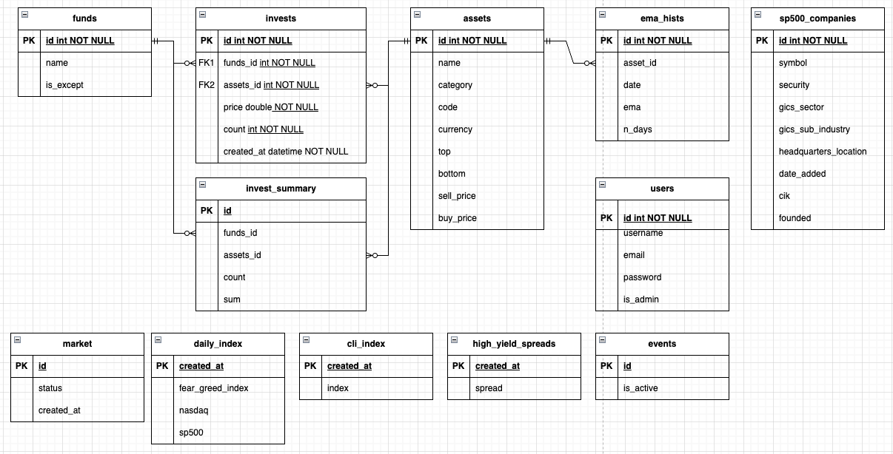

# 투자 포트폴리오 관리 서버

## 개요

사전에 정한 규칙에 맞추어 자산을 실시간으로 관리하고, 투자 기회를 자동으로 포착하는 통합 자산 관리 시스템입니다. 여러 자금을 독립적으로 관리하면서, 시장 상황과 종목 가격에 따라 자동으로 매수/매도 알림을 전송하고, 투자 이력을 추적합니다.

### 핵심 기능

1. **실시간 자산 모니터링** - WebSocket 스트리밍을 통한 지속적 가격 추적 및 거래 내역 자동 반영
2. **지능형 투자 알림** - 시장 단계별 포트폴리오 리밸런싱 및 매매/매도 시점 감지
3. **다중 거래소 통합** - 주식, ETF, 암호화폐, 블록체인 DEX 등 다양한 자산 클래스 통합 관리
4. **자동화 트레이딩** - 아비트라지 감지, 에어드랍 이벤트 추적, DEX 유동성 관리
5. **투자 이력 관리** - 자금별 투자 내역, 포트폴리오 분석, 수익률 추적

## 아키텍처

### 시스템 구성도

```
    ┌─────────────────────────────────────┐
    │    Main Application Entry Point     │
    │      (Fiber + Telegram Bot)         │
    └──────┬────────────────────────┬─────┘
           │                        │
    ┌──────▼──────┐         ┌───────▼───────┐
    │  REST API   │         │ Telegram Bot  │
    │  (:8080)    │         │  (Polling)    │
    └──────┬──────┘         └───────┬───────┘
           │                        │
    ┌──────▼────────────────────────▼──────┐
    │    InvestIndicator (Event Handler)   │
    │  ├─ Cron Scheduler                   │
    │  ├─ Always-On WebSocket Streams      │
    │  └─ Manual Event Triggers            │
    └──────┬────────────────────────┬──────┘
           │                        │
    ┌──────▼──────┐         ┌───────▼────────┐
    │   Scraper   │         │  BlockChain    │
    │    (APIs)   │         │    Trader      │
    └──────┬──────┘         └────────┬───────┘
           │                        │
    ┌──────▼────────────────────────▼──────────┐
    │         Data Layer                       │
    │         ├─ MySQL (GORM)                  │
    │         └─ Redis (Caching)               │
    └──────────────────────────────────────────┘
```

### 패키지 구조

- **investindicator.go** - 이벤트 오케스트레이터
  - Cron 스케줄러 관리
  - WebSocket 스트림 관리
  - 비즈니스 로직 핸들러
- **app** - REST API 서버 (Fiber)
  - 자산 현황 조회/등록
  - 투자 이력 저장
  - 종목 정보 관리 (CRUD)
  - 시장 단계 설정
  - 이벤트 제어 (on/off)
- **bot** - Telegram Bot 통합
  - 실시간 알림 전송 (매수/매도 시점, 포트폴리오 리밸런싱)
  - 인터랙티브 버튼 (자금 선택, 이벤트 수동 실행)
  - HTTP 요청 대리 수행
- **scrape** - 외부 데이터 통합
  - **주식/ETF**: 한국투자증권 API
  - **암호화폐**: Upbit (WebSocket), Bithumb (REST), Alpaca
  - **시장 지표**: Fear & Greed Index, FRED High Yield Spread
  - **기타**: 네이버 환율, S&P 500 구성 종목, 부동산 크롤링
- **blockchain** - EVM 블록체인 통합
  - Uniswap V3 스왑 실행 (Avalanche C-Chain)
  - Permit2 트랜잭션 관리
  - ERC20 토큰 자동 스왑 (USDT/USDC)
- **internal**
  - **db** - 데이터베이스 추상화
    - MySQL - 자금, 종목, 투자 내역, 시장 데이터
    - Redis - 환율 캐싱 (3시간), 에어드랍 URL (90일)
    - 이벤트 상태 지속성 관리
  - **model** - 도메인 모델
    - Fund, Asset, Invest, InvestSummary
    - Market, DailyIndex, EmaHist, HighYieldSpread

## 주요 기능 상세

### 1. 시장 단계별 자산 관리

시장을 5단계로 구분하여, 각 단계별로 변동 자산(주식, 암호화폐 등) 비중을 조정합니다.

| 단계 | 시장 예측 | 변동 자산 비중 |
|-----|----------|--------------|
| 1   | 큰 하락   | 10~15%    |
| 2   | 하락     | 15~20%   |
| 3   | 변동     | 20~25%   |
| 4   | 상승     | 25~30%   |
| 5   | 큰 상승   | 30~40%    |

**자동 알림**

- 변동 자산 비중 초과 시: 우선 처분 대상 종목 리스트 제공
- 최소 비중 미달 시: 우선 구매 대상 종목 리스트 제공

**우선 순위 계산**
- 처분 우선순위: 현재가가 EMA200(비중 60%) 및 고점(비중 40%)보다 높을수록
- 구매 우선순위: 현재가가 고점 및 EMA200보다 낮을수록

### 2. 실시간 가격 모니터링

#### WebSocket 스트리밍 (항시 실행)
- **Upbit 프라이빗 스트림**
  - 체결 완료 주문 자동 투자 내역 반영

#### REST API 폴링 (주기적 실행)
- **주식/ETF 가격**: 15분 간격 (평일 9-23시)
- **암호화폐 가격**: 15분 간격 (매일 8-23시)
- **AVAX DEX 관리**: 1분 간격
- **에어드랍 이벤트**: 10분 간격

### 3. 종목 관리

종목은 10가지 카테고리로 분류되며, 4단계 이후를 변동 자산으로 취급합니다.

| 카테고리 | 1    | 2    | 3  | 4        | 5       | 6        | 7        | 8        | 9       | 10       |
|---------|------|------|----|----------|---------|----------|----------|----------|---------|----------|
| 의미     | 현금 | 달러 | 금 | 단기채권 | 국내ETF | 국내주식 | 국내코인 | 해외주식 | 해외ETF | 레버리지 |

**종목 정보**
- 이름, 구분, 통화, 고점, 저점
- 기준 매도가 (선택): 없을 경우 매도 미대상 (단, 리밸런싱 시 고점 비교)
- 기준 매수가 (선택): 없을 경우 저점 사용

**자동 계산**

- EMA200 (Exponential Moving Average) 자동 계산 및 업데이트
- 고점/저점 크롤링 자동 갱신

### 4. 매수/매도 알림

- **매도 알림**: 현재가 >= 기준 매도가
- **매수 알림**: 현재가 <= 기준 매수가 (또는 저점)
- **점진적 알림**: 기준가에서 10%씩 벗어날 때마다 추가 알림
- **중복 방지**: 가격 변동 전까지 동일 알림 차단
- **알림 정보**: 종목명, 구분, 통화, 고점, 저점, 기준가, 현재가, 자금별 사용 가능 금액

### 5. 자동화 기능

#### 김치 프리미엄 모니터링
- **암호화폐 프리미엄**: 국내 vs 해외 거래소 가격 차이 감지
  - 5%, 10% 임계값 도달 시 알림
  - 매수/매도 추천
- **금 프리미엄**: 유사한 전략 적용

#### 에어드랍 이벤트 자동 감지
- **대상 거래소**: Upbit, Bithumb
- **실행 주기**: 8-23시, 10분 간격

#### BLACKHOLE(AVAX DEX) 유동성 관리
- **유동성 모니터링**: 공급한 유동성 pool에서 현재 시세가 벗어나는지 여부 실시간 모니터링 
- **자동 리밸런싱**: 시세가 나의 pool에서 벗어난다면, 포지션을 회수하고 자산 비율을 다시 50:50으로 리밸런싱
- **단계적 진입**: 가격이 급격하게 변동하는 추세라면, 바로 포지션을 잡는 것이 아닌 가격이 진정될 때까지 대기 후 진입

#### 자동 토큰 스왑
- **체인**: Avalanche C-Chain
- **대상**: USDT <-> USDC
- **빈도**: 1일 10회 (방향 교차)
- **목적**: 프로토콜 활동 유지
- **검증**: 트랜잭션 영수증 확인 (최대 10회 폴링)

#### ~~S&P 500 신규 종목 자동 매수~~
- **감지**: 주간 단위 S&P 500 구성 종목 변경 추적
- **자동 매수 로직**:
  - Fund 1 전용
  - 대상: SPLG (S&P 500 ETF)
  - 예산: Min(300,000 KRW, 사용 가능 금액)
  - 환율 자동 변환: 실시간 USD/KRW

### 6. 수동 이벤트 실행

Telegram Bot을 통해 다음 이벤트를 수동으로 즉시 실행 가능:

1. 자산 추천 (Asset Recommendation)
2. 금 김치 프리미엄 체크
3. 코인 김치 프리미엄 체크
4. AVAX DEX 관리
5. 에어드랍 이벤트 감지
6. USDT/USDC 스왑 실행

### 7. Cron 스케줄

```
AssetEvent         → 15분 간격 (평일 9-23시) - 주식/ETF 가격 갱신
CoinEvent          → 15분 간격 (주말 8-23시) - 암호화폐 가격 갱신
DailyEvent         → 평일 7:00 AM
  ├─ IndexEvent             - FGI, Nasdaq, S&P 500 지수 수집
  ├─ EmaUpdateEvent         - EMA200 계산 및 업데이트
  ├─ HighYieldSpreadEvent   - FRED High Yield Spread 수집
  ├─ AssetRecommendEvent    - 포트폴리오 추천
  └─ FindNewSP500Event      - S&P 500 신규 종목 감지
RealEstateEvent    → 15분 간격 (평일 9-17시) - 부동산 상태 변화 체크
```

## API 설계

### 자금 (`/funds`)
- `GET /` - 전체 현황 조회
- `POST /` - 신규 자금 추가
- `GET /:id/hist` - 자금 투자 이력
- `GET /:id/assets` - 자금 종목별 총액 조회

### 종목 (`/assets`)
- `POST /` - 종목 정보 저장
- `POST /:id` - 종목 정보 갱신
- `DELETE /:id` - 종목 정보 삭제
- `GET /:id` - 종목 정보 조회
- `GET /list` - 종목 목록 조회
- `GET /:id/hist` - 종목 투자 이력 조회

### 시장상태 (`/market`)
- `POST /` - 시장 단계 저장
- `GET /` - 시장 상태 조회
- `GET /indicators` - 시장 지표 조회 (FGI, High Yield Spread)

### 투자 (`/invest`)
- `POST /` - 내역 저장

### 이벤트 (`/event`)
- `GET /` - 이벤트 목록 조회
- `POST /:id` - 이벤트 on/off 토글

## 데이터베이스 모델링



### 주요 테이블
- **funds**: 자금 그룹 (예: 공통자금, 퇴직자금, 개인투자자금)
- **assets**: 거래 대상 등록 자산 항목 (주식, 암호화폐, 상품)
- **invests**: 투자 이력
- **invest_summary**: 현재 보유 내역 (자금/자산별)
- **ema_hists**: assets에 등록된 목록에 대한 EMA200 히스토리 데이터
- **events**: 스케줄된 이벤트 설정
- **market**: 현재 시장 단계 (1-5)
- **daily_indices**: Fear & Greed Index, Nasdaq, S&P 500
- **high_yield_spreads**: 회사채 스프레드 데이터
- **users** : 계정 관리
- **sp500_companies** : s&p500에 등록된 회사 목록


### EMA 계산 수식

```
SMAt = (PRICEt - SMAy) / (N+1) + SMAy

a = 2 / (N+1)
EMAt = a * PRICEt + (1-a) * EMAy
```

- 초기값: SMA200 사용

## 기술 스택

### 언어 및 프레임워크
- **Go 1.24.0** - 메인 런타임
- **Fiber v2.52** - 고성능 HTTP 웹 프레임워크
- **GORM 1.25** - ORM (MySQL 드라이버)
- **Redis v9** - 캐싱 및 지속성 스토리지


### 통합 시스템

| 통합 대상 | 타입 | 용도 |
|----------|------|------|
| **Upbit** | WebSocket/REST API | 국내 암호화폐 거래, 주문 스트리밍 /국내 암호화폐 가격 |
| **Bithumb** | REST API | 국내 암호화폐 가격 |
| **한국투자증권** | REST API | 국내 주식/ETF |
| **Alpaca** | REST API | 해외 암호화폐 |
| **Fear & Greed Index** | REST API | 시장 심리 지표 |
| **FRED** | REST API | High Yield Spread |
| **Uniswap V3** | Smart Contract | Avalanche DEX 스왑 |

## 설정 및 배포

### 환경 설정

1. **Go 설치**
   ```bash
   export GOROOT=/usr/local/go
   export PATH=$PATH:$GOROOT/bin
   export GOPATH=$HOME/go
   export PATH=$PATH:$GOPATH/bin
   export GOMODCACHE=$HOME/golang/pkg/mod
   ```

2. **MySQL 도커 컨테이너**
   ```bash
   docker run -v /invest/db:/var/lib/mysql \
     --name investDb \
     -e MYSQL_ROOT_PASSWORD={password} \
     -d -p 3306:3306 mysql \
     --character-set-server=utf8mb4 \
     --collation-server=utf8mb4_unicode_ci
   ```

3. **스키마 생성**
   ```bash
   docker exec -i -t investDb bash
   mysql -u root -p
   CREATE SCHEMA invest_indicator DEFAULT CHARACTER SET utf8;
   USE invest_indicator;
   ```

### Mock 생성

```bash
go install github.com/vektra/mockery/v2@v2.44.1
go generate ./...
```

인터페이스에 주석 추가:
```go
//go:generate mockery --name {interface name} --case underscore --inpackage
```

### 자동 배포 설정

#### 1. GitHub Webhook을 통한 자동 재기동

**webhook 서버 (auto_deploy.go)**
```go
app := fiber.New()

app.Post("/invest_indicator", func(c *fiber.Ctx) error {
  cmd := exec.Command("./auto_invest_indicator.sh")
  if err := cmd.Run(); err != nil {
    return c.SendString(err.Error())
  }
  return nil
})

app.Listen(":10000")
```

**배포 스크립트 (auto_invest_indicator.sh)**
```bash
#!/bin/sh
cd ~/workspace/invest_indicator
git pull origin main
/home/cho/go/bin/go build -o invest_indicator
PID=$(cat pidfile.txt 2>/dev/null)
if kill -0 $PID 2>/dev/null; then
  echo "Process $PID is running. Kill process"
  kill $PID
fi
./invest_indicator &
echo $! > pidfile.txt
```

#### 2. 서버 재부팅 시 자동 실행

**자동 실행 스크립트**
```bash
#!/bin/sh
docker start mysql
cd ~/workspace/personal_projects/auto_deploy

for file in ./auto*; do
  if [ -x "$file" ]; then
    "$file"
  fi
done
```

**Crontab 등록**
```bash
crontab -e
# 추가
@reboot /path/to/your/auto_start_script.sh
```

### 로깅

```bash
nohup ./invest_indicator > $(date +%F).log 2>&1 &
```

- `&`: 백그라운드 프로세스 실행
- `> $(date +%F).log`: stdout을 날짜별 파일로 저장
- `2>&1`: stderr도 동일 로그에 포함

## 운영 노트

### Float64 정밀도 문제

**문제**: 수수료 및 코인 수량의 정확한 계산

**검토한 방안**:
1. 현상 유지 (float64 + MySQL Double)
2. 전체 decimal.Decimal 변경
3. Price와 Count만 decimal.Decimal
4. DB 레이어만 decimal.Decimal

**결론**: Float64는 소수점 15자리까지 신뢰 가능하므로 현재 유지. 토큰 수량의 정밀한 확인이 필요한 경우 재검토.

### 주요 패치 노트

- **25.03.16**
  - event API 추가 (조회 및 on/off 기능)
- **25.03.17**
  - top price, EMA 중 하나라도 없으면 포트폴리오 추천에서 제외
  - asset 등록 시 EMA 자동 계산
- **25.11.06** 
  - Upbit WebSocket에 ping/pong keep-alive 추가 (연결 끊김 방지)
  - Upbit 주문 스트림 자동 투자 내역 반영
  - 코인 prefix 처리 리팩토링 (scrape → 거래소별)
  - 미등록 자산 거래 시 알림 추가
- **25.12.27** 
  - Blackhole dex 관리 agent 추가
  - 실시간 유동성 공급 관리

## 참고 자료

- EMA 초기값 계산: https://www.barchart.com/stocks/quotes/AAPL/technical-analysis
- 시장 지표: https://kr.investing.com/
- 포트 개방: https://generalcoder.tistory.com/29


## 보안

- API 키 및 로그인 정보는 암호화하여 DB 저장
- 서버에서 복호화 후 사용
- 복호화 키는 서버 재시작 시 Telegram Bot을 통해 요청