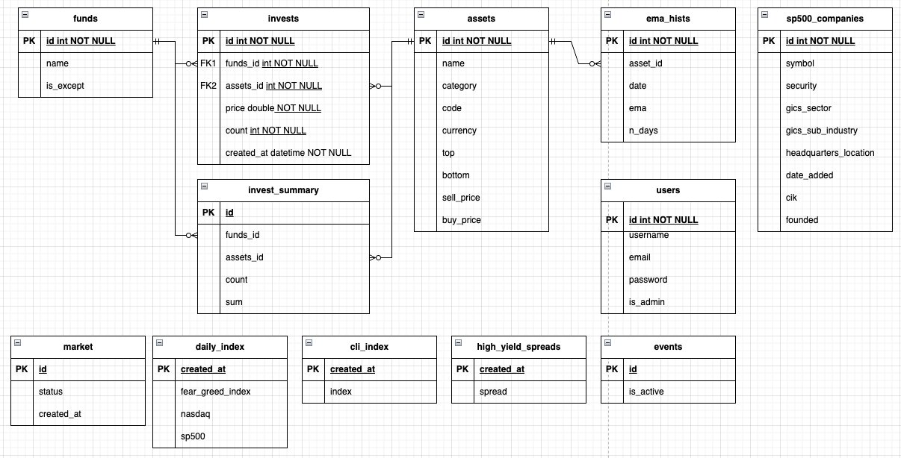

# Investment Portfolio Management Server

## Overview

An integrated asset management system that manages assets in real-time according to predefined rules and automatically captures investment opportunities. It independently manages multiple funds while automatically sending buy/sell alerts based on market conditions and asset prices, and tracks investment history.

### Key Features

1. **Real-time Asset Monitoring** - Continuous price tracking through WebSocket streaming and automatic reflection of transaction history
2. **Intelligent Investment Alerts** - Portfolio rebalancing by market phase and buy/sell timing detection
3. **Multi-Exchange Integration** - Unified management of various asset classes including stocks, ETFs, cryptocurrencies, and blockchain DEX
4. **Automated Trading** - Arbitrage detection, airdrop event tracking, DEX liquidity management
5. **Investment History Management** - Investment records by fund, portfolio analysis, and return tracking

## Architecture

### System Architecture

```
    ┌─────────────────────────────────────┐
    │    Main Application Entry Point     │
    │      (Fiber + Telegram Bot)         │
    └──────┬────────────────────────┬─────┘
           │                        │
    ┌──────▼──────┐         ┌───────▼───────┐
    │  REST API   │         │ Telegram Bot  │
    │  (:8080)    │         │  (Polling)    │
    └──────┬──────┘         └───────┬───────┘
           │                        │
    ┌──────▼────────────────────────▼──────┐
    │    InvestIndicator (Event Handler)   │
    │  ├─ Cron Scheduler                   │
    │  ├─ Always-On WebSocket Streams      │
    │  └─ Manual Event Triggers            │
    └──────┬────────────────────────┬──────┘
           │                        │
    ┌──────▼──────┐         ┌───────▼────────┐
    │   Scraper   │         │  BlockChain    │
    │    (APIs)   │         │    Trader      │
    └──────┬──────┘         └────────┬───────┘
           │                        │
    ┌──────▼────────────────────────▼──────────┐
    │         Data Layer                       │
    │         ├─ MySQL (GORM)                  │
    │         └─ Redis (Caching)               │
    └──────────────────────────────────────────┘
```

### Package Structure

- **investindicator.go** - Event Orchestrator
  - Cron scheduler management
  - WebSocket stream management
  - Business logic handlers
- **app** - REST API Server (Fiber)
  - Asset status inquiry/registration
  - Investment history storage
  - Asset information management (CRUD)
  - Market phase configuration
  - Event control (on/off)
- **bot** - Telegram Bot Integration
  - Real-time notifications (buy/sell timing, portfolio rebalancing)
  - Interactive buttons (fund selection, manual event execution)
  - HTTP request proxy
- **scrape** - External Data Integration
  - **Stocks/ETFs**: Korea Investment Securities API
  - **Cryptocurrencies**: Upbit (WebSocket), Bithumb (REST), Alpaca
  - **Market Indicators**: Fear & Greed Index, FRED High Yield Spread
  - **Others**: Naver exchange rates, S&P 500 constituents, real estate crawling
- **blockchain** - EVM Blockchain Integration
  - Blackhole Dex position automatic rebalancing
  - Uniswap V3 swap execution (Avalanche C-Chain)
  - ERC20 token automatic swap (USDT/USDC)
- **internal**
  - **db** - Database Abstraction
    - MySQL - Funds, assets, investment history, market data
    - Redis - Exchange rate caching (3 hours), airdrop URLs (90 days)
    - Event state persistence management
  - **model** - Domain Models
    - Fund, Asset, Invest, InvestSummary
    - Market, DailyIndex, EmaHist, HighYieldSpread

## Feature Details

### 1. Asset Management by Market Phase

The market is divided into 5 phases, with volatile asset (stocks, cryptocurrencies, etc.) allocations adjusted for each phase.

| Phase | Market Forecast | Volatile Asset Ratio |
|-------|----------------|---------------------|
| 1     | Major Decline  | 10~15%             |
| 2     | Decline        | 15~20%             |
| 3     | Volatile       | 20~25%             |
| 4     | Rise           | 25~30%             |
| 5     | Major Rise     | 30~40%             |

**Automatic Alerts**

- When volatile asset ratio exceeds: Provides priority sell target list
- When below minimum ratio: Provides priority buy target list

**Priority Calculation**
- Sell priority: Higher when current price exceeds EMA200 (60% weight) and peak price (40% weight)
- Buy priority: Higher when current price is below peak and EMA200


### 2. Real-time Price Monitoring

#### WebSocket Streaming (Always Active)
- **Upbit Private Stream**
  - Automatic investment history reflection for completed orders

#### REST API Polling (Periodic)
- **Stock/ETF Prices**: 15-minute intervals (weekdays 9-23)
- **Cryptocurrency Prices**: 15-minute intervals (daily 8-23)
- **AVAX DEX Management**: 1-minute intervals
- **Airdrop Events**: 10-minute intervals


### 3. Asset Management

Assets are classified into 10 categories, with categories 4 and above treated as volatile assets.

| Category | 1    | 2      | 3    | 4           | 5           | 6              | 7               | 8              | 9              | 10       |
|----------|------|--------|------|-------------|-------------|----------------|-----------------|----------------|----------------|----------|
| Type     | Cash | Dollar | Gold | Short Bonds | Domestic ETF | Domestic Stock | Domestic Crypto | Foreign Stock | Foreign ETF | Leverage |

**Asset Information**
- Name, category, currency, peak price, bottom price
- Target sell price (optional): If not set, excluded from sell alerts (but compared to peak during rebalancing)
- Target buy price (optional): If not set, uses bottom price

**Automatic Calculation**

- EMA200 (Exponential Moving Average) automatic calculation and updates
- Peak/bottom price automatic crawling and updates


### 4. Buy/Sell Alerts

- **Sell Alert**: Current price >= Target sell price
- **Buy Alert**: Current price <= Target buy price (or bottom price)
- **Progressive Alerts**: Additional alerts for every 10% deviation from target price
- **Duplicate Prevention**: Blocks same alert until price changes
- **Alert Information**: Asset name, category, currency, peak, bottom, target price, current price, available balance by fund


### 5. Automation Features

#### Kimchi Premium Monitoring
- **Cryptocurrency Premium**: Detects price difference between domestic vs foreign exchanges
  - Alerts when 5%, 10% thresholds are reached
  - Buy/sell recommendations
- **Gold Premium**: Similar strategy applied

#### Automatic Airdrop Event Detection
- **Target Exchanges**: Upbit, Bithumb
- **Execution Cycle**: 8-23, 10-minute intervals

#### BLACKHOLE (AVAX DEX) Liquidity Management
- **Liquidity Monitoring**: Real-time monitoring of whether current price deviates from supplied liquidity pool
- **Automatic Rebalancing**: If price deviates from pool, withdraw position and rebalance asset ratio to 50:50
- **Gradual Entry**: If price is rapidly fluctuating, wait until price stabilizes before entering position

#### Automatic Token Swap
- **Chain**: Avalanche C-Chain
- **Target**: USDT <-> USDC
- **Frequency**: 10 times per day (alternating directions)
- **Purpose**: Maintain protocol activity
- **Verification**: Transaction receipt confirmation (up to 10 polling attempts)

#### New S&P 500 Constituent Alerts

- Alerts when new stocks are added to S&P 500 index


### 6. Manual Event Execution

The following events can be manually executed immediately through Telegram Bot:

1. Asset Recommendation
2. Gold Kimchi Premium Check
3. Coin Kimchi Premium Check
4. AVAX DEX Management
5. Airdrop Event Detection
6. USDT/USDC Swap Execution

### 7. Cron Schedule

```
AssetEvent         → 15-minute intervals (weekdays 9-23) - Stock/ETF price updates
CoinEvent          → 15-minute intervals (daily 8-23) - Cryptocurrency price updates
DailyEvent         → Weekdays 7:00 AM
  ├─ IndexEvent             - FGI, Nasdaq, S&P 500 index collection
  ├─ EmaUpdateEvent         - EMA200 calculation and updates
  ├─ HighYieldSpreadEvent   - FRED High Yield Spread collection
  ├─ AssetRecommendEvent    - Portfolio recommendations
  └─ FindNewSP500Event      - S&P 500 new constituent detection
RealEstateEvent    → 15-minute intervals (weekdays 9-17) - Real estate status change check
```

## API Design

### Funds (`/funds`)
- `GET /` - View overall status
- `POST /` - Add new fund
- `GET /:id/hist` - Fund investment history
- `GET /:id/assets` - View fund total by asset

### Assets (`/assets`)
- `POST /` - Save asset information
- `POST /:id` - Update asset information
- `DELETE /:id` - Delete asset information
- `GET /:id` - View asset information
- `GET /list` - View asset list
- `GET /:id/hist` - View asset investment history

### Market Status (`/market`)
- `POST /` - Save market phase
- `GET /` - View market status
- `GET /indicators` - View market indicators (FGI, High Yield Spread)

### Investment (`/invest`)
- `POST /` - Save history

### Events (`/event`)
- `GET /` - View event list
- `POST /:id` - Toggle event on/off

## Database Modeling



### Main Tables
- **funds**: Fund groups (e.g., common fund, retirement fund, personal investment fund)
- **assets**: Registered tradable asset items (stocks, cryptocurrencies, commodities)
- **invests**: Investment history
- **invest_summary**: Current holdings (by fund/asset)
- **ema_hists**: EMA200 history data for assets registered in assets table
- **events**: Scheduled event configuration
- **market**: Current market phase (1-5)
- **daily_indices**: Fear & Greed Index, Nasdaq, S&P 500
- **high_yield_spreads**: Corporate bond spread data
- **users**: Account management
- **sp500_companies**: List of companies in S&P 500


### EMA Calculation Formula

```
SMAt = (PRICEt - SMAy) / (N+1) + SMAy

a = 2 / (N+1)
EMAt = a * PRICEt + (1-a) * EMAy
```

- Initial value: Uses SMA200

## Tech Stack

### Language and Framework
- **Go 1.24.0** - Main runtime
- **Fiber v2.52** - High-performance HTTP web framework
- **GORM 1.25** - ORM (MySQL driver)
- **Redis v9** - Caching and persistence storage


### Integration Systems

| Integration | Type | Purpose |
|------------|------|---------|
| **Upbit** | WebSocket/REST API | Domestic cryptocurrency trading, order streaming / Domestic cryptocurrency prices |
| **Bithumb** | REST API | Domestic cryptocurrency prices |
| **Korea Investment Securities** | REST API | Domestic stocks/ETFs |
| **Alpaca** | REST API | Foreign cryptocurrencies |
| **Fear & Greed Index** | REST API | Market sentiment indicator |
| **FRED** | REST API | High Yield Spread |
| **Uniswap V3** | Smart Contract | Avalanche DEX swaps |
